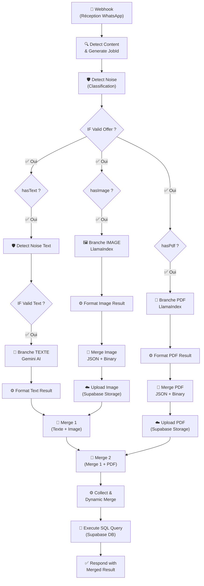
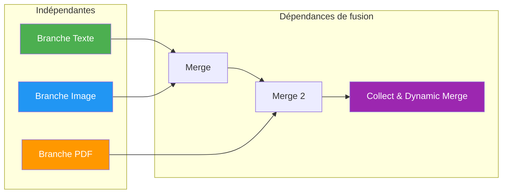

# 📖 Documentation Technique — Workflows n8n TrackTreck

> **Objectif** : Ce document décrit la logique métier de chaque workflow n8n du projet TrackTreck, le rôle de chaque nœud, et les liens métier entre les différentes branches de traitement. Il est destiné à faciliter l'onboarding des nouveaux développeurs.

---

## Table des matières

1. [Vue d'ensemble du système](#1-vue-densemble-du-système)
2. [Architecture Fan-Out / Fan-In](#2-architecture-fan-out--fan-in)
3. [Workflow : `whatsapp_pipeline`](#3-workflow--whatsapp_pipeline)
   - [3.1 Description métier globale](#31-description-métier-globale)
   - [3.2 Phase d'entrée — Réception & Détection](#32-phase-dentrée--réception--détection)
   - [3.3 Branche TEXTE — Extraction par IA conversationnelle](#33-branche-texte--extraction-par-ia-conversationnelle)
   - [3.4 Branche IMAGE — Extraction via LlamaIndex + Archivage S3](#34-branche-image--extraction-via-llamaindex--archivage-s3)
   - [3.5 Branche PDF — Extraction via LlamaIndex + Archivage S3](#35-branche-pdf--extraction-via-llamaindex--archivage-s3)
   - [3.6 Phase de fusion — Merge & Réponse](#36-phase-de-fusion--merge--réponse)
4. [Description détaillée de chaque nœud](#4-description-détaillée-de-chaque-nœud)
5. [Liens métier entre les branches](#5-liens-métier-entre-les-branches)
6. [Schéma JSON de sortie](#6-schéma-json-de-sortie)
7. [Services externes et dépendances](#7-services-externes-et-dépendances)
8. [Glossaire](#8-glossaire)

---

## 1. Vue d'ensemble du système

TrackTreck est un système d'automatisation qui **intercepte des offres de voyage diffusées sur un groupe WhatsApp** et les **transforme automatiquement en données structurées** exploitables par une application métier.

Le pipeline n8n agit comme le **cœur d'orchestration** du système. Il reçoit les messages WhatsApp via un webhook (connecté à Evolution API), détecte le type de contenu (texte, image, PDF), lance les extractions en parallèle via de l'IA, stocke les fichiers médias dans **Supabase Storage**, puis fusionne les résultats pour les insérer automatiquement dans **Supabase Database** (PostgreSQL).

```
┌─────────────────────────────────────────────────────────────────────────────┐
│                           FLUX GLOBAL DU SYSTÈME                            │
│                                                                             │
│   WhatsApp    Evolution API     n8n Pipeline         Supabase               │
│   ────────►   ────────────►   ──────────────►   ──────────────────────►     │
│   (Groupe)     (Webhook)      (Extraction IA)   (Storage Fichiers + DB)     │
└─────────────────────────────────────────────────────────────────────────────┘
```

---

## 2. Architecture Fan-Out / Fan-In

Le workflow `whatsapp_pipeline` implémente une architecture **Fan-Out / Fan-In** :

- **Fan-Out** : Un message entrant est analysé et redirigé simultanément vers **3 branches parallèles** selon le type de contenu détecté (texte, image, PDF).
- **Fan-In** : Les résultats partiels de chaque branche sont **fusionnés intelligemment** en un seul objet JSON unifié.



> [!IMPORTANT]
> Un même message WhatsApp peut contenir **plusieurs types de contenu simultanément** (ex : un texte + une image). Un **filtre anti-bruit global** (`Detect Noise`) est appliqué pour éviter de traiter des messages non pertinents (salutations, demandes de visa, etc.). Les branches s'activent de manière indépendante selon les flags `hasText`, `hasImage`, `hasPdf`.

---

## 3. Workflow : `whatsapp_pipeline`

**Identifiant n8n** : `FRUnC4ibP8dhLXyn`  
**Nom** : `whatsapp_pipeline`  
**Statut** : Inactif (activation manuelle requise)  
**Mode d'exécution** : `v1` (séquentiel par branche)  
**Mode binaire** : `separate`

### 3.1 Description métier globale

Ce workflow est le **pipeline principal** de TrackTreck. Sa mission métier est de :

1. **Recevoir** un message WhatsApp transmis par Evolution API via webhook
2. **Classifier** automatiquement le type de contenu (texte brut, image, document PDF)
3. **Extraire** les données structurées de l'offre de voyage via intelligence artificielle
4. **Stocker** les médias originaux (images, PDF) dans un bucket privé **Supabase Storage** (classés par pays et agence)
5. **Fusionner** les résultats partiels de chaque source en un JSON unifié
6. **Insérer** les données structurées (avec le statut `draft` et `needs_review: true`) dans la base de données **Supabase**
7. **Répondre** au webhook avec le résumé de l'insertion SQL

---

### 3.2 Phase d'entrée — Réception & Détection

Cette phase est le **tronc commun** du workflow. Tous les messages passent par ces 2 nœuds avant le fan-out.

| Ordre | Nœud | Rôle métier |
|-------|------|-------------|
| 1 | `Webhook` | Point d'entrée HTTP — reçoit le payload WhatsApp d'Evolution API |
| 2 | `Detect Content & Generate JobId` | Analyse le message, détecte les types de contenu, génère un identifiant de job unique |
| 3 | `Detect Noise` | Analyse heuristique du message. Attribue un score basé sur les mots-clés (voyage, vol, prix vs bonjour, cv, visa) et classifie le flux (`valid_travel_offer`, `noise`, `excluded_visa_offer`, etc.) |
| 4 | `IF Valid Offer` | Stoppe l'exécution si le message est classifié comme bruit. Route vers les branches conditionnelles (fan-out) si valide. |

---

### 3.3 Branche TEXTE — Extraction par IA conversationnelle

**Condition d'activation** : `hasText === true`

Cette branche traite le **contenu textuel** du message WhatsApp (conversation simple, texte étendu, ou légendes d'images/documents).

| Ordre | Nœud | Rôle métier |
|-------|------|-------------|
| 1 | `if texte` | Vérifie la présence de texte dans le message |
| 2 | `Detect Noise Text` | Refiltre spécifiquement le texte pour ignorer les textes sans valeur métier (ex: un flyer image valide mais accompagné d'un simple "ok") |
| 3 | `IF Valid Text Offer` | Vérifie si le booléen `is_valid_offer` est vrai avant de solliciter le modèle IA |
| 4 | `Edit Fields` | Formate le texte brut en objet structuré `{text, type, sender}` |
| 5 | `Message a model` | Envoie le texte au modèle **Gemma 3 12B** (Google Gemini) avec un prompt d'extraction spécialisé voyage |
| 6 | `Format Text Result` | Parse la réponse du modèle IA, nettoie le JSON, applique des corrections métier et enrobe le résultat payload (`_hasData`) |

> [!NOTE]
> Le modèle IA utilisé est `gemma-3-12b-it` via l'API Google Gemini. Le prompt est entièrement en anglais et contient le schéma JSON de sortie attendu. Le nœud est configuré avec `retryOnFail: true` pour résilience.

**Corrections métier automatiques (`Format Text Result`)** :
- Normalisation des noms de pays (ex : `Turkey` → `Turquie`)
- Nettoyage des itinéraires vides (tous les champs `null` → objet vide)
- Typage fort des nombres et déduplication des listes

---

### 3.4 Branche IMAGE — Extraction via LlamaIndex + Supabase Storage

**Condition d'activation** : `hasImage === true`

Cette branche traite les **images** (photos d'affiches, flyers, captures d'écran d'offres).

| Ordre | Nœud | Rôle métier |
|-------|------|-------------|
| 1 | `if image` | Vérifie la présence d'une image dans le message |
| 2 | `HTTP Request` | Appelle Evolution API pour récupérer l'image en **Base64** |
| 3 | `Convert to File` | Convertit le Base64 en fichier binaire (propriété `image`) |
| 4 | `LLama Extraction` | **Extraction** : Envoi de l'image à LlamaIndex Cloud pour parsing intelligent |
| 5 | `Wait` | Pause de **15 secondes** — temps de traitement LlamaIndex |
| 6 | `Get Parse Result` | Récupère le résultat du parsing auprès de l'API LlamaIndex |
| 7 | `Format Image Result` | Extrait le JSON de LlamaIndex, le normalise et l'enrobe comme payload (`_hasData`) |
| 8 | `Merge Image JSON + Binary` | Fusionne le JSON extrait (Input 1) et le fichier binaire (Input 2) pour l'upload |
| 9 | `Upload image` | **Archivage** : Upload de l'image sur Supabase Storage (bucket `travel-offer-assets` organisé par pays et agence) |

> [!NOTE]
> L'étape de merge avant l'upload (étape 8) est obligatoire pour fournir au nœud Supabase Storage à la fois les informations extraites pour construire le chemin dynamique (pays, agence) et le fichier binaire de l'image à uploader.

---

### 3.5 Branche PDF — Extraction via LlamaIndex + Supabase Storage

**Condition d'activation** : `hasPdf === true`

Cette branche traite les **documents PDF** (brochures, programmes de voyage, grilles tarifaires).

| Ordre | Nœud | Rôle métier |
|-------|------|-------------|
| 1 | `if pdf` | Vérifie la présence d'un PDF dans le message |
| 2 | `HTTP Request1` | Appelle Evolution API pour récupérer le PDF en **Base64** |
| 3 | `Convert to File1` | Convertit le Base64 en fichier binaire (propriété `document`) |
| 4 | `LLama Extraction1` | **Extraction** : Envoi du PDF à LlamaIndex Cloud avec des instructions de parsing très détaillées |
| 5 | `Wait1` | Pause de **25 secondes** — temps de traitement LlamaIndex (plus long pour les PDF) |
| 6 | `Get Parse Result 2` | Récupère le résultat du parsing auprès de l'API LlamaIndex |
| 7 | `Format PDF Result` | Extrait le JSON de LlamaIndex, le normalise et l'enrobe comme payload (`_hasData`) |
| 8 | `Merge PDF JSON + Binary` | Fusionne le JSON extrait avec le fichier binaire issu du nœud `Convert to File1` |
| 9 | `Upload PDF` | **Archivage** : Upload du PDF sur Supabase Storage (bucket `travel-offer-assets` organisé par pays et agence) |

> [!TIP]
> Le temps d'attente est de 25 secondes pour les PDF (vs 15 secondes pour les images) car les documents PDF contiennent généralement plus de contenu à analyser (tableaux de prix, programmes jour par jour).

**Différences clés entre l'extraction Image et PDF** :

| Critère | Image | PDF |
|---------|-------|-----|
| Temps d'attente LlamaIndex | 15 secondes | 25 secondes |
| Chemin Supabase Storage | `{country}/agency-{agency_id}/images/{timestamp}.jpg` | `{country}/agency-{agency_id}/pdf/{timestamp}.pdf` |
| Prompt d'extraction | Court, schéma JSON inclus | Très détaillé, 13 règles obligatoires |
| Propriété binaire | `image` | `document` |

---

### 3.6 Phase de fusion — Merge & Réponse

Cette phase est le **Fan-In** : elle rassemble les résultats partiels de toutes les branches activées et produit un JSON final unifié.

| Ordre | Nœud | Rôle métier |
|-------|------|-------------|
| 1 | `Merge` | Fusionne les sorties de la branche **Texte** et de la branche **Image** |
| 2 | `Merge 2` | Fusionne le résultat du `Merge` avec la sortie de la branche **PDF** |
| 3 | `Collect & Dynamic Merge` | Logique métier de fusion intelligente — combine les résultats partiels en un seul objet JSON unifié |
| 4 | `Execute a SQL query` | Insère directement les données finalisées dans la base de données PostgreSQL (Supabase) via une requête transactionnelle (CTE) |
| 5 | `Respond with Merged Result` | Retourne la réponse HTTP 200 avec les résultats d'insertion de la base de données |

> [!IMPORTANT]
> Le nœud `Collect & Dynamic Merge` est le **cœur de la logique métier de fusion**. Il implémente un algorithme de merge qui :
> - Détecte les formats d'entrée (format enveloppé `_hasData/payload` ou objet brut)
> - Fusionne les champs scalaires avec une stratégie **"premier non-null gagne"**
> - Déduplique les listes (pays, services, photos) via `uniqueStrings()`
> - Merge les étapes (steps) par `step_order` avec fusion récursive des hôtels
> - Merge les départs (departures) par clé composite `(ville, date départ, date retour)`

---

## 4. Description détaillée de chaque nœud

### 4.1 `Webhook`
| Propriété | Valeur |
|-----------|--------|
| **Type** | `n8n-nodes-base.webhook` |
| **Méthode** | `POST` |
| **Chemin** | `7b471905-3691-4018-8526-d17145d27d29` |
| **Mode de réponse** | `responseNode` (la réponse est envoyée par un nœud dédié en fin de pipeline) |
| **Rôle métier** | Point d'entrée du pipeline. Reçoit les payloads JSON envoyés par Evolution API à chaque nouveau message WhatsApp intercepté. Le mode `responseNode` signifie que le webhook garde la connexion HTTP ouverte jusqu'à ce que le nœud `Respond with Merged Result` envoie la réponse. |

---

### 4.2 `Detect Content & Generate JobId`
| Propriété | Valeur |
|-----------|--------|
| **Type** | `n8n-nodes-base.code` (JavaScript) |
| **Rôle métier** | C'est le **cerveau de classification** du pipeline. Il inspecte le payload WhatsApp et détermine quel(s) type(s) de contenu sont présents. |

**Logique détaillée** :
1. **Extraction du texte** : Cherche dans `conversation`, `extendedTextMessage.text`, `imageMessage.caption`, `documentMessage.caption` (par priorité)
2. **Détection d'image** : Cherche un `imageMessage` (y compris dans `viewOnceMessage` et `ephemeralMessage`)
3. **Détection de PDF** : Cherche un `documentMessage` dont le MIME type contient `pdf` ou dont le nom de fichier se termine par `.pdf`
4. **Génération du JobId** : Crée un identifiant unique `job_{timestamp}_{random}` pour le traçage
5. **Extraction du sender** : Récupère l'identifiant WhatsApp de l'expéditeur (`remoteJid`)

**Sortie** :
```json
{
  "jobId": "job_1713182400000_abc123def",
  "senderJid": "213xxxxxxxxx@s.whatsapp.net",
  "messageId": "...",
  "hasText": true,
  "hasImage": false,
  "hasPdf": true,
  "text": "Offre Turquie 7 nuits...",
  "imageCaption": "",
  "image": null,
  "pdf": { "mimetype": "application/pdf", ... }
}
```

---

### 4.3 `if texte` / `if image` / `if pdf`
| Propriété | Valeur |
|-----------|--------|
| **Type** | `n8n-nodes-base.if` |
| **Rôle métier** | Nœuds de branchement conditionnel. Chaque nœud vérifie un flag booléen (`hasText`, `hasImage`, `hasPdf`) et route les données vers la branche appropriée. |

> Ces 3 nœuds sont **exécutés en parallèle** depuis le nœud `Detect Content & Generate JobId`. Ils constituent le **point de fan-out**.

---

### 4.4 `Edit Fields`
| Propriété | Valeur |
|-----------|--------|
| **Type** | `n8n-nodes-base.set` |
| **Rôle métier** | Reformate le texte brut du message en un objet simplifié pour le modèle IA. |

**Transformation** :
```json
{
  "text": "<contenu du message>",
  "type": "text",
  "sender": "<remoteJid>"
}
```

---

### 4.5 `Message a model` (Google Gemini)
| Propriété | Valeur |
|-----------|--------|
| **Type** | `@n8n/n8n-nodes-langchain.googleGemini` |
| **Modèle** | `gemma-3-12b-it` |
| **Retry on fail** | ✅ Oui |
| **Rôle métier** | Envoie le texte du message WhatsApp au modèle d'IA avec un prompt spécialisé pour l'extraction d'offres de voyage. Le modèle retourne un JSON structuré. |

**Points clés du prompt** :
- Contexte : messages WhatsApp contenant possiblement des offres de voyage
- Instructions : nettoyer le formatage WhatsApp (emojis, sauts de ligne), extraire les données clés
- Cas spéciaux : billet d'avion seul vs package complet
- Sortie : JSON strict avec `title`, `countries`, `steps`, `departures`, `services`, `pricing`

---

### 4.6 `Code in JavaScript` (Nettoyage sortie IA Texte)
| Propriété | Valeur |
|-----------|--------|
| **Type** | `n8n-nodes-base.code` |
| **Rôle métier** | Parse et corrige la sortie brute du modèle IA pour garantir un JSON valide et métier-correct. |

**Corrections appliquées** :
1. Suppression des balises markdown (` ```json `) autour du JSON
2. Parsing du JSON avec gestion d'erreur
3. Normalisation des pays (`Turkey` → `Turquie`)
4. Détection heuristique de la compagnie aérienne
5. Nettoyage des itinéraires vides
6. Conversion des dates `JJ/MM` → ISO 8601 (`2026-MM-JJT00:00:00Z`)

---

### 4.7 `HTTP Request` / `HTTP Request1` (Récupération médias)
| Propriété | Image (`HTTP Request`) | PDF (`HTTP Request1`) |
|-----------|----------------------|----------------------|
| **Type** | `n8n-nodes-base.httpRequest` | `n8n-nodes-base.httpRequest` |
| **URL** | `http://host.docker.internal:8080/chat/getBase64FromMediaMessage/tracktrek` | idem |
| **Auth** | Header Auth (`apikey` credential) | Header Auth (`apikey` credential) |
| **Rôle métier** | Appelle l'API Evolution pour récupérer le contenu binaire du média en Base64. Le message WhatsApp ne contient pas directement le fichier — il faut le télécharger via l'API en passant l'ID du message. |

---

### 4.8 `Convert to File` / `Convert to File1`
| Propriété | Valeur |
|-----------|--------|
| **Type** | `n8n-nodes-base.convertToFile` |
| **Opération** | `toBinary` |
| **Rôle métier** | Convertit la chaîne Base64 récupérée de l'API Evolution en un fichier binaire exploitable par les nœuds suivants (upload S3, envoi à LlamaIndex). |

| Nœud | Source | Propriété binaire |
|------|--------|-------------------|
| `Convert to File` | `base64` | `image` |
| `Convert to File1` | `base64` | `document` |

---

### 4.9 `Merge Image/PDF JSON + Binary`
| Propriété | Valeur |
|-----------|--------|
| **Type** | `n8n-nodes-base.merge` |
| **Mode** | `Combine by position` |
| **Rôle métier** | Nœud technique crucial pour synchroniser le flux de l'IA (JSON) et de l'API Evolution (binaire). Fusionne le JSON (Input 1) et le fichier média binaire (Input 2) pour que le nœud d'upload Supabase puisse à la fois lire les métadonnées (pour le chemin du dossier pays/agence) et envoyer le contenu binaire. |

---

### 4.10 `Upload image` / `Upload PDF` (Supabase Storage)
| Propriété | Image (`Upload image`) | PDF (`Upload PDF`) |
|-----------|-------------------------|-------------------------|
| **Type** | `n8n-nodes-base.supabase` | `n8n-nodes-base.supabase` |
| **Bucket** | `travel-offer-assets` (privé) | `travel-offer-assets` (privé) |
| **Chemin dynamique** | `{country}/agency-{agency_id}/images/{timestamp}.jpg` | `{country}/agency-{agency_id}/pdf/{timestamp}.pdf` |
| **Rôle métier** | Stocke de façon persistante le média original dans Supabase Storage. L'arborescence dynamique permet un classement hiérarchique par pays, puis par agence, et enfin par type de média. |

---

### 4.11 `LLama Extraction` / `LLama Extraction1` (Envoi à LlamaIndex)
| Propriété | Image | PDF |
|-----------|-------|-----|
| **Type** | `n8n-nodes-base.httpRequest` | `n8n-nodes-base.httpRequest` |
| **URL** | `https://api.cloud.llamaindex.ai/api/parsing/upload` | idem |
| **Auth** | Bearer Token (`$env.LLAMA_PARSE_API_KEY`) | idem |
| **Rôle métier** | Soumet le fichier binaire (image ou PDF) au service **LlamaParse** (LlamaIndex Cloud) pour extraction intelligente de contenu structuré. Un prompt d'extraction est inclus pour guider le parsing. |

**Prompt d'extraction PDF (13 règles)** — Principales directives :
1. Ne jamais inventer d'informations absentes du document
2. Texte manquant → `""` / Nombre manquant → `0` / Date manquante → `null`
3. Détection automatique du mode de pricing (global vs par hôtel)
4. Mapping `is_default: true` uniquement pour l'hôtel principal
5. Retour JSON brut strict, sans markdown ni commentaire

---

### 4.12 `Wait` / `Wait1` (Attente LlamaIndex)
| Propriété | Image (`Wait`) | PDF (`Wait1`) |
|-----------|---------------|----------------|
| **Durée** | 15 secondes | 25 secondes |
| **Rôle métier** | Pause nécessaire pour laisser à LlamaIndex Cloud le temps de traiter le fichier. Le résultat n'est pas immédiat car le parsing est asynchrone côté LlamaIndex. |

---

### 4.13 `Get Parse Result` / `Get Parse Result 2`
| Propriété | Valeur |
|-----------|--------|
| **Type** | `n8n-nodes-base.httpRequest` |
| **URL** | `https://api.cloud.llamaindex.ai/api/parsing/job/{job_id}/result/json` |
| **Rôle métier** | Récupère le résultat du parsing LlamaIndex une fois le traitement terminé. Le `job_id` est obtenu de la réponse du nœud `LLama Extraction` précédent. |

---

### 4.14 `Format Text Result` / `Format Image Result` / `Format PDF Result`
| Propriété | Valeur |
|-----------|--------|
| **Type** | `n8n-nodes-base.code` |
| **Rôle métier** | Parse le résultat natif de l'IA (LLM ou LlamaIndex), applique d'importantes corrections métier, gère les potentiels échecs, harmonise les types et enveloppe le tout dans un format standardisé `{ _hasData, extractionType, source, payload }` attendu par le Merge de fin. |

---

### 4.15 `Merge` / `Merge 2`
| Propriété | Valeur |
|-----------|--------|
| **Type** | `n8n-nodes-base.merge` |
| **Version** | 3.2 |
| **Rôle métier** | Nœuds de jonction qui rassemblent les items de plusieurs branches. `Merge` combine Texte + Image. `Merge 2` combine (Texte+Image) + PDF. |

**Chaîne de fusion** :
```
Branche Texte ──┐
                 ├──► Merge ──┐
Branche Image ──┘             ├──► Merge 2 ──► Collect & Dynamic Merge
                              │
Branche PDF ─────────────────┘
```

---

### 4.16 `Collect & Dynamic Merge`
| Propriété | Valeur |
|-----------|--------|
| **Type** | `n8n-nodes-base.code` |
| **Rôle métier** | **Nœud critique** — Fusionne intelligemment tous les résultats partiels en un seul objet JSON normalisé. |

**Algorithme de fusion** :

1. **Détection des résultats partiels** :
   - Format enveloppé (`{ _hasData: true, payload: {...} }`)
   - Format brut (objet contenant `agency_id`, `services`, `steps` ou `departures`)

2. **Template de base** : Initialise un objet vide avec tous les champs du schéma

3. **Fusion des champs scalaires** : Stratégie `"premier non-null gagne"` pour `title`, `airline`, `description`, `duration_nights`, `lead_price`

4. **Fusion des listes** :
   - `countries`, `photo_urls` : union avec dédoublonnage
   - `services.included`, `services.excluded` : union avec dédoublonnage

5. **Fusion des étapes (steps)** :
   - Matching par `step_order`
   - Merge récursif des hôtels (matching par `hotel_id` + `custom_hotel_name`)
   - Tri final par `step_order`

6. **Fusion des départs (departures)** :
   - Matching par clé composite `(departure_city, flight_departure_time, return_flight_departure_time)`
   - Enrichissement des champs manquants

---

### 4.17 `Execute a SQL query`
| Propriété | Valeur |
|-----------|--------|
| **Type** | `n8n-nodes-base.postgres` |
| **Opération** | `executeQuery` |
| **Rôle métier** | Insère l'objet métier final directement dans la base de données PostgreSQL de production (Supabase). Utilise une CTE (Common Table Expression) SQL complexe pour insérer de manière transactionnelle : l'agence par défaut (si manquante), l'offre (`tours`), les étapes (`tour_steps`), les options d'hôtels (`hotel_options`), et les départs (`departures`). Applique automatiquement le statut `status = 'draft'` et `needs_review = true` (offre "à valider"). Retourne un résumé du nombre de lignes insérées. |

---

### 4.18 `Respond with Merged Result`
| Propriété | Valeur |
|-----------|--------|
| **Type** | `n8n-nodes-base.respondToWebhook` |
| **Code HTTP** | `200` |
| **Rôle métier** | Envoie la réponse HTTP au client qui a déclenché le webhook. Le body contient le résumé d'insertion retourné par Supabase. |

---

## 5. Liens métier entre les branches

### 5.1 Complémentarité des sources

Les 3 branches ne sont pas des alternatives — elles sont **complémentaires**. Un même message WhatsApp d'agence de voyage peut contenir :

| Scénario | Texte | Image | PDF | Résultat attendu |
|----------|-------|-------|-----|-------------------|
| Message texte simple | ✅ | ❌ | ❌ | JSON extrait du texte uniquement |
| Flyer image seul | ❌ | ✅ | ❌ | JSON extrait de l'image + archivage S3 |
| PDF programme détaillé | ❌ | ❌ | ✅ | JSON extrait du PDF + archivage S3 |
| Texte + image promo | ✅ | ✅ | ❌ | Fusion des 2 extractions |
| Message complet (texte + image + PDF) | ✅ | ✅ | ✅ | Fusion des 3 extractions |

### 5.2 Priorité de la fusion

Lors de la fusion par `Collect & Dynamic Merge`, la stratégie **"premier non-null gagne"** implique un ordre de priorité implicite :

1. **Branche Texte** → arrive en premier (pas de délai d'attente)
2. **Branche Image** → arrive en second (15s d'attente)
3. **Branche PDF** → arrive en dernier (25s d'attente)

> [!TIP]
> Cela signifie que si le texte contient un titre et que le PDF contient un titre différent, **le titre du texte sera conservé**. Les listes (services, pays, étapes) sont quant à elles **accumulées** à partir de toutes les sources.

### 5.3 Dépendances inter-branches



**Règles de dépendance** :
- Les 3 branches sont **indépendantes** entre elles (exécution parallèle)
- `Merge` attend la complétion de **Texte ET Image** (ou une seule si l'autre n'est pas activée)
- `Merge 2` attend la complétion de **Merge ET PDF** (ou un seul)
- `Collect & Dynamic Merge` s'exécute une fois que toutes les données disponibles sont rassemblées

### 5.4 Flux de données inter-branches

| Source → Destination | Données transmises |
|----------------------|--------------------|
| Webhook → Detect Content | Payload WhatsApp brut (`body.data.message`) |
| Detect Content → Branches | Flags `hasText/hasImage/hasPdf` + données brutes |
| Branche Texte → Merge | JSON d'offre extrait par Gemini AI |
| Branche Image → Merge | JSON d'offre extrait par LlamaIndex |
| Branche PDF → Merge 2 | JSON d'offre extrait par LlamaIndex |
| Merge 2 → Collect & Dynamic Merge | Tableau de tous les résultats partiels |
| Collect & Dynamic Merge → Execute a SQL query | JSON final unifié |
| Execute a SQL query → Respond | Résumé d'insertion SQL |

---

## 6. Schéma JSON de sortie

Le JSON final produit par le pipeline suit ce schéma strict :

```json
{
  "title": "string — Titre de l'offre",
  "agency_id": "number — ID de l'agence (défaut: 1)",
  "countries": ["string — Pays de destination"],
  "duration_nights": "number — Nombre de nuitées",
  "airline": "string — Compagnie aérienne",
  "description": "string — Description de l'offre",
  "itinerary": "object — Programme jour par jour",
  "status": "string — Statut de l'offre (défaut: 'draft')",
  "photo_urls": ["string — URLs des photos archivées"],
  "is_global_pricing": "boolean — true si tarif unique pour toute l'offre",
  "global_pricing": "object|null — Tarification globale",
  "lead_price": "number — Prix d'appel",
  "services": {
    "included": ["string — Services inclus"],
    "excluded": ["string — Services exclus"]
  },
  "steps": [
    {
      "city": "string — Ville de l'étape",
      "step_order": "number — Ordre de l'étape",
      "duration_nights": "number — Nuitées dans cette étape",
      "hotels": [
        {
          "hotel_id": "number|null — ID hôtel (si connu)",
          "custom_hotel_name": "string — Nom de l'hôtel",
          "is_default": "boolean — Hôtel par défaut",
          "pricing": {
            "single": "number",
            "double": "number",
            "triple": "number"
          }
        }
      ]
    }
  ],
  "departures": [
    {
      "departure_city": "string — Ville de départ",
      "stock": "number|null — Nombre de places",
      "flight_departure_time": "string|null — Date/heure départ aller",
      "flight_arrival_time": "string|null — Date/heure arrivée aller",
      "return_flight_departure_time": "string|null — Date/heure départ retour",
      "return_flight_arrival_time": "string|null — Date/heure arrivée retour"
    }
  ]
}
```

---

## 7. Services externes et dépendances

| Service | Rôle | Accès | Environnement |
|---------|------|-------|---------------|
| **Evolution API** | Passerelle WhatsApp — interception des messages et récupération des médias | `http://host.docker.internal:8080` | Docker local |
| **Google Gemini** (Gemma 3 12B) | IA générative pour extraction textuelle | API Google PaLM | Credential n8n `Google Gemini(PaLM) Api account` |
| **LlamaIndex Cloud** (LlamaParse) | Parsing intelligent de documents et images | `https://api.cloud.llamaindex.ai` | Variable d'env `LLAMA_PARSE_API_KEY` |
| **Supabase Storage** | Stockage objet sécurisé pour les images et documents PDF extraits | Credential n8n `Supabase Storage Local` | Bucket `travel-offer-assets` (Privé) |
| **Supabase DB** | Base de données métier (PostgreSQL) | Credential n8n `Postgres account` | Base `postgres` (port 54322) |

### Variables d'environnement requises

| Variable | Usage |
|----------|-------|
| `LLAMA_PARSE_API_KEY` | Clé API pour LlamaIndex Cloud (utilisée dans les nœuds LLama Extraction) |

### Credentials n8n requis

| Nom | Type | Utilisé par |
|-----|------|-------------|
| `apikey` | HTTP Header Auth | `HTTP Request`, `HTTP Request1` (récupération médias) |
| `Google Gemini(PaLM) Api account` | Google PaLM API | `Message a model` |
| `Supabase Storage Local` | Supabase / S3 | `Upload image`, `Upload PDF` |
| `Postgres account` | Postgres | `Execute a SQL query` |

---

## 8. Glossaire

| Terme | Définition |
|-------|------------|
| **Evolution API** | API open-source permettant d'interagir avec WhatsApp via WebSocket. Gère l'envoi/réception de messages et la récupération de médias. |
| **Fan-Out** | Pattern architectural où un message entrant est dupliqué et envoyé vers plusieurs branches de traitement en parallèle. |
| **Fan-In** | Pattern architectural où les résultats de plusieurs branches parallèles sont rassemblés et fusionnés en un seul résultat. |
| **LlamaParse** | Service cloud de LlamaIndex spécialisé dans le parsing intelligent de documents (PDF, images). Utilise de l'IA pour extraire des données structurées. |
| **Gemma 3** | Modèle de langage open-source de Google, utilisé ici pour l'extraction de données structurées à partir de texte libre. |
| **remoteJid** | Identifiant WhatsApp de l'expéditeur (format : `numéro@s.whatsapp.net`). |
| **Base64** | Encodage binaire en texte, utilisé ici comme format intermédiaire pour transférer les médias WhatsApp. |
| **Fire-and-forget** | Pattern où une action est lancée sans attendre son résultat. Utilisé pour l'archivage S3. |
| **Draft** | Statut par défaut des offres extraites. Indique qu'une validation humaine est nécessaire avant publication. |

---

## 9. Axes d'amélioration

Bien que le workflow actuel soit fonctionnel, plusieurs axes peuvent être envisagés pour accroître la maintenabilité, les performances et la résilience :

1. **Parallélisme natif via sub-workflows** :  
   Actuellement, les branches Image et PDF exécutent des pauses (`Wait` de 15s/25s) qui bloquent potentiellement d'autres opérations si n8n n'est pas optimisé pour l'asynchronisme massif. Sous-traiter l'extraction IA dans un Sub-Workflow n8n appelé en mode *Background/Non-blocking* pourrait accélérer le Fan-Out.

2. **Webhook Webhooks LlamaParse (Push vs Pull)** :  
   Au lieu d'utiliser des nœuds `Wait` arbitraires limités dans le temps, LlamaCloud supporte probablement les webhooks de callback à la fin d'un job. Repenser la récupération des extractions de fichiers avec un Webhook Catch réduirait l'attente inutile et éviterait les timeouts.

3. **Validation par schéma stricte du payload** :  
   Bien que les blocs `Format * Result` fassent un nettoyage manuel robuste, l'introduction d'un validateur JSON Schema externe (tel qu'un appel simple à Ajv via Node) garantit qu'aucune structure inattendue ne vient corrompre la base de données.

4. **Gestion unifiée des rejets (bruit)** :  
   Les messages identifiés comme `noise` ou `excluded_visa_offer` par `Detect Noise` s'arrêtent silencieusement dans le pipeline. Un système de logging léger ou de réponse silencieuse (avec accusé de réception 200 vide) peut éviter de laisser les requêtes Evolution "en suspens" ou provoquer des timeouts non attrapés dans les logs d'Evolution API.

---

> [!NOTE]
> **Dernière mise à jour** : Avril 2026  
> **Workflow source** : [`whatsapp_pipeline.json`](../workflows/n8n/whatsapp_pipeline.json)  
> **Version du workflow** : `3c849dde-29d6-4bde-b239-e9787df37ac0`
